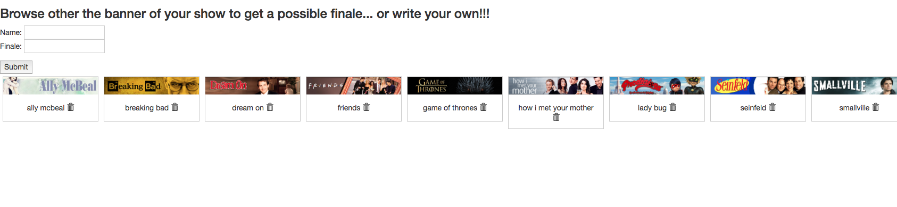

sample tvshows app showing finales for tvshows



## How to install

For banners of the tvshows to show up, You will need to set *TVDB_KEY* environment variable to your tdvb api key

### Create crd and sample data

```
kubectl create -f crd.yml
kubectl apply -f crd/
```

### Install app

```
docker run -it -v $HOME/.kube:/root/.kube -p 9000:9000 -e TVDB_KEY=$TVDB_KEY karmab/tvshows:v2
```
